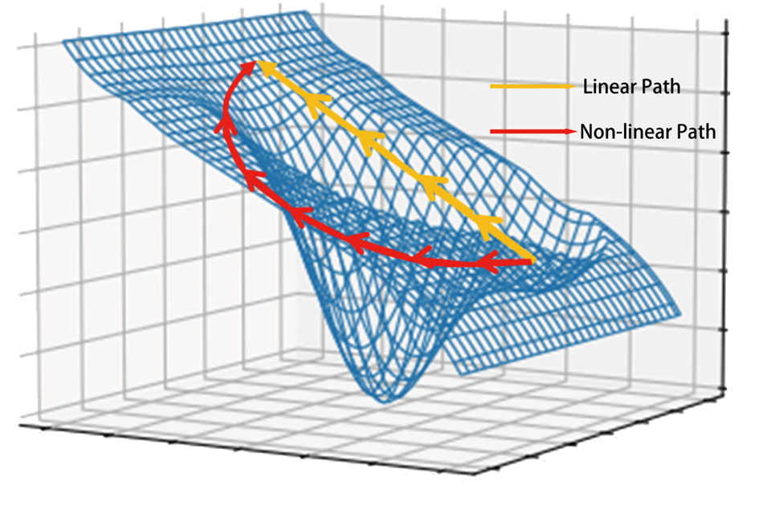

<div align="center">

# MFABA: A More Faithful and Accelerated Boundary-based Attribution Method for Deep Neural Networks


[](https://arxiv.org/abs/2312.13630)
[](https://opensource.org/licenses/MIT)
[](https://aaai.org/aaai-conference/)

</div>
<table align="center">
  <tr>
    <td align="center"> 
       
      <br>
      <em style="font-size: 18px;">  <strong style="font-size: 18px;">Figure 1:</strong> Linear and non-linear path of the direction for ad-
versarial attack and baseline samples.</em>
    </td>
  </tr>
</table>


## Abstract
To better understand the output of deep neural networks (DNN), attribution based methods have been an important approach for model interpretability, which assign a score for each input dimension to indicate its importance towards the model outcome. Notably, the attribution methods use the axioms of sensitivity and implementation invariance to ensure the validity and reliability of attribution results. Yet, the existing attribution methods present challenges for effective interpretation and efficient computation. In this work, we introduce MFABA, an attribution algorithm that adheres to axioms, as a novel method for interpreting DNN. Additionally, we provide the theoretical proof and in-depth analysis for MFABA algorithm, and conduct a large scale experiment. The results demonstrate its superiority by achieving over 101.5142 times faster speed than the state-of-the-art attribution algorithms. The effectiveness of MFABA is thoroughly evaluated through the statistical analysis in comparison to other methods.

## Environment Setup

To replicate our experiments, ensure your environment meets the following prerequisites:

- Python 3.8+
- foolbox==3.3.3
- numpy==1.24.2
- pandas==1.5.3
- Pillow==9.5.0
- PyTorch==2.0.0+cu118
- torchvision==0.15.1+cu118
- tqdm==4.65.0

## Compute Attribution

Complete examples are shown in `example.ipynb`.Here are some sample code.

```python
from saliency.saliency_zoo import mfaba_sharp

# Load your model
model = load_model(...)
model.to(device)
model.eval()

# Load your data
img_batch = torch.load("data/img_batch.pt") # img_batch.shape = (1000,3,224,224)
target_batch = torch.load("data/label_batch.pt") # target_batch.shape = (1000,)

# Set batch_size
batch_size = 128
attributions = [] # init attributions

# Caculate attribution
for i in range(0, len(img_batch), batch_size):
    img = img_batch[i:i+batch_size].to(device)
    target = target_batch[i:i+batch_size].to(device)
    attributions.append(mfaba_sharp(model, img, target))
if attributions[0].shape.__len__() == 3:
    attributions = [np.expand_dims(attribution, axis=0) for attribution in attributions]
attributions = np.concatenate(attributions, axis=0)
```

## Results

<table>
<em style="font-size: 18px;">  <strong style="font-size: 18px;">Table 1:</strong> Insertion score (the higher the better), deletion score (the lower the better), and AUC (the higher the better), SMOOTH and SHARP are variants of our Method MFABA.</em>
<thead>
  <tr>
    <th>Model</th>
    <th>Method</th>
    <th>Insertion Score</th>
    <th>Deletion Score</th>
    <th>AUC</th>
  </tr>
</thead>
<tbody>
  <tr>
    <td>Inception-v3</td>
    <td>SM</td>
    <td>0.2792</td>
    <td>0.0445</td>
    <td>0.5150</td>
  </tr>
  <tr>
    <td>Inception-v3</td>
    <td>IG</td>
    <td>0.3215</td>
    <td>0.0445</td>
    <td>0.5180</td>
  </tr>
  <tr>
    <td>Inception-v3</td>
    <td>BIG</td>
    <td>0.4840</td>
    <td>0.0557</td>
    <td>0.5200</td>
  </tr>
  <tr>
    <td>Inception-v3</td>
    <td>AGI</td>
    <td>0.4629</td>
    <td>0.0590</td>
    <td>0.5178</td>
  </tr>
  <tr>
    <td>Inception-v3</td>
    <td>SMOOTH</td>
    <td>0.5368</td>
    <td>0.0640</td>
    <td>0.5389</td>
  </tr>
  <tr>
    <td>Inception-v3</td>
    <td>SHARP</td>
    <td>0.5407</td>
    <td>0.0627</td>
    <td>0.5367</td>
  </tr>
  <tr>
    <td>ResNet-50</td>
    <td>SM</td>
    <td>0.1441</td>
    <td>0.0387</td>
    <td>0.4714</td>
  </tr>
  <tr>
    <td>ResNet-50</td>
    <td>IG</td>
    <td>0.1467</td>
    <td>0.0302</td>
    <td>0.4823</td>
  </tr>
  <tr>
    <td>ResNet-50</td>
    <td>BIG</td>
    <td>0.2911</td>
    <td>0.0485</td>
    <td>0.4759</td>
  </tr>
  <tr>
    <td>ResNet-50</td>
    <td>AGI</td>
    <td>0.3695</td>
    <td>0.0383</td>
    <td>0.4772</td>
  </tr>
  <tr>
    <td>ResNet-50</td>
    <td>SMOOTH</td>
    <td>0.3211</td>
    <td>0.0574</td>
    <td>0.4854</td>
  </tr>
  <tr>
    <td>ResNet-50</td>
    <td>SHARP</td>
    <td>0.3237</td>
    <td>0.0566</td>
    <td>0.4857</td>
  </tr>
  <tr>
    <td>VGG16</td>
    <td>SM</td>
    <td>0.1018</td>
    <td>0.0297</td>
    <td>0.4257</td>
  </tr>
  <tr>
    <td>VGG16</td>
    <td>IG</td>
    <td>0.0973</td>
    <td>0.0249</td>
    <td>0.4431</td>
  </tr>
  <tr>
    <td>VGG16</td>
    <td>BIG</td>
    <td>0.2274</td>
    <td>0.0390</td>
    <td>0.4356</td>
  </tr>
  <tr>
    <td>VGG16</td>
    <td>AGI</td>
    <td>0.2910</td>
    <td>0.0320</td>
    <td>0.4359</td>
  </tr>
  <tr>
    <td>VGG16</td>
    <td>SMOOTH</td>
    <td>0.2808</td>
    <td>0.0424</td>
    <td>0.4540</td>
  </tr>
  <tr>
    <td>VGG16</td>
    <td>SHARP</td>
    <td>0.2856</td>
    <td>0.0410</td>
    <td>0.4540</td>
  </tr>
</tbody>
</table>

<table>
<em style="font-size: 18px;">  <strong style="font-size: 18px;">Table 2:</strong> FPS Results of BIG, IG, AGI, MFABA Algorithms.</em>
<thead>
  <tr>
    <th>Dataset</th>
    <th>Method</th>
    <th>BIG</th>
    <th>IG</th>
    <th>AGI</th>
    <th>MFABA</th>
  </tr>
</thead>
<tbody>
  <tr>
    <td>CIFAR10</td>
    <td>ResNet-50</td>
    <td>1.35</td>
    <td>24.64</td>
    <td>0.14</td>
    <td>136.96</td>
  </tr>
  <tr>
    <td>CIFAR100</td>
    <td>ResNet-50</td>
    <td>1.36</td>
    <td>24.29</td>
    <td>0.15</td>
    <td>162.74</td>
  </tr>
  <tr>
    <td>ImageNet</td>
    <td>ResNet-50</td>
    <td>0.37</td>
    <td>6.76</td>
    <td>0.28</td>
    <td>51.58</td>
  </tr>
  <tr>
    <td>ImageNet</td>
    <td>EfficientNet</td>
    <td>0.32</td>
    <td>10.42</td>
    <td>0.21</td>
    <td>39.97</td>
  </tr>
</tbody>
</table>

## Citation

For academic usage, please cite our paper:

```
@article{zhu2023mfaba,
  title={MFABA: A More Faithful and Accelerated Boundary-based Attribution Method for Deep Neural Networks},
  author={Zhu, Zhiyu and Chen, Huaming and Zhang, Jiayu and Wang, Xinyi and Jin, Zhibo and Xue, Minhui and Zhu, Dongxiao and Choo, Kim-Kwang Raymond},
  journal={arXiv preprint arXiv:2312.13630},
  year={2023}
}
```
